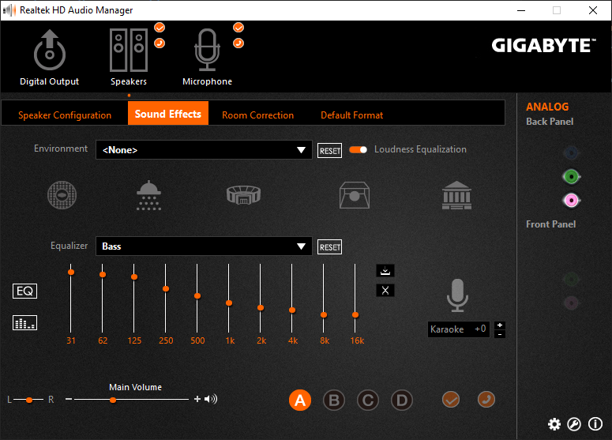
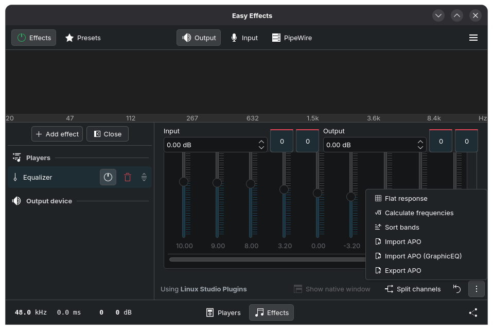
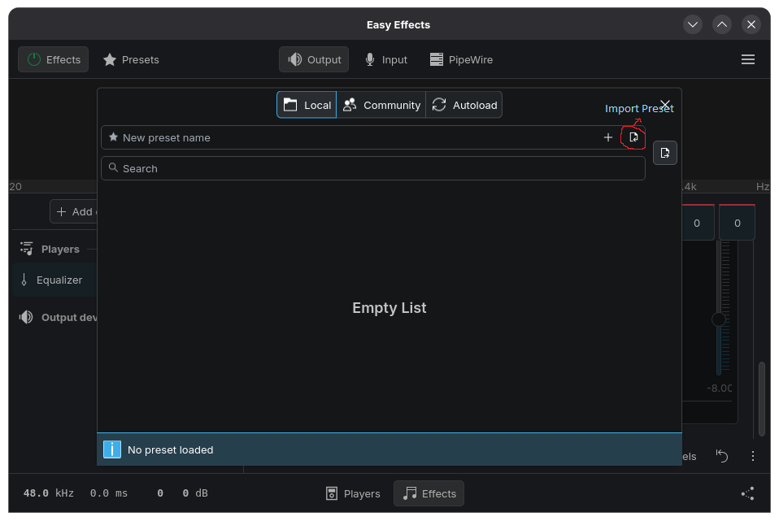

# Linux Audio Setup Guide

A guide for setting up audio on Linux, including how to export your Realtek HD Audio equalizer presets from Windows so you can use them on Linux.

---

## Exporting Realtek HD Audio EQ Presets from Windows

### Step 1 — Open the Realtek Audio Console

1. Launch **Realtek Audio Console** on Windows.
2. Go to **Speakers → Sound Effects**.
3. In the **Equalizer** section, select the EQ preset you want to export (e.g. *Bass*, *Treble*, etc.).
4. Click on the **EQ graph** to reveal the ISO frequency band values.
5. Note down the frequency ranges shown — you'll need these later.

> **Screenshot reference:**


> ### 💡 Skip the extraction?
> Before you start, check the pre-extracted presets in the directory: [realtek-graphic-eqs (B250M-D2V)](./realtek-graphic-eqs%20(B250M-D2V)).

>
> For example, **Bass-GraphicEq.txt** uses this format:
> ```text
> GraphicEQ: 31 10; 62 9; 125 8; 250 3.2; 500 0; 1000 -3.2; 2000 -5; 4000 -6.7; 8000 -8; 16000 -8
> ```
> *Format: `GraphicEQ: <Band(1)> <Value>; <Band(2)> <Value>; ... <Band(n)> <Value>`*
>
> If these match your settings, you can skip extraction and import them (or their preset versions in [realtek-sound-effects (B250M-D2V)](./realtek-sound-effects%20(B250M-D2V))) directly into EasyEffects.

> [!IMPORTANT]
> **Decimal Precision:** The Realtek UI may show whole numbers (e.g., `10`), but the registry often stores exact values with decimals (e.g., `10.2`). To validate 100% accuracy, follow **Option A** to extract the values from your own system and compare against the pre-extracted presets.

---

### Step 2 — Choose an Export Method

You have two options to extract the EQ settings:

---

#### ✅ Option A: Python Script (Recommended)

This method is faster and more accurate — it reads EQ values directly from the Windows registry.

**Before running the script:**

Make sure the frequency ranges shown in your **Realtek Audio Console** match the frequencies defined inside `extract_active_eq_reg.py`. If they don't match, open the script and update the frequency values to match your console.

**Run the script:**

```bash
python extract_active_eq_reg.py
```

**Output:**

The script will create a folder called `graphic-eqs (active)` and save the EQ settings as a text file inside it.

**Repeat** this process for each EQ preset you want to export — select the preset in the console first, then run the script again.

---

#### 🔧 Option B: Manual Method (Using the GUI)

Use this if the Python script doesn't work for you. It's more tedious but doesn't require running any code.

**If frequency values are visible in the UI:**

Read the values from each slider and save them in this format:
`GraphicEQ: <Band(1)> <Value>; <Band(2)> <Value>; ... <Band(n)> <Value>`

**Example:**
```text
GraphicEQ: 31 10; 62 9; 125 8; 250 3.2; 500 0; 1000 -3.2; 2000 -5; 4000 -6.7; 8000 -8; 16000 -8
```


**If frequency values are hidden (sliders only):**

You can reveal value by carefully clicking on each slider. Watch out — clicking a slider may change your preset to "Custom", which means your original preset values have been modified.

To avoid this:
1. If the preset name changes to **Custom**, re-select your original preset immediately.
2. Then try clicking the slider more precisely — just enough to reveal the value without adjusting it.

Repeat this for every frequency slider across all presets you want to export.

---

> **Note:** The Realtek Audio Console may display frequency values as whole numbers in the UI, while the registry stores them with decimal precision. If you need exact decimal values, you will need to modify `extract_active_eq_reg.py` to get the raw registry values use LLM to help you with that.

---

---

## Using the Extracted EQ Settings on Linux with EasyEffects

### Step 1 — Install EasyEffects

EasyEffects is available as a Flatpak on [Flathub](https://flathub.org/apps/com.github.wwmm.easyeffects). You can install it via your distro's app store, or run:

```bash
flatpak install flathub com.github.wwmm.easyeffects
```

---

### Step 2 — Import Your EQ Settings

There are two types of files you may have exported. Import them differently:

#### Importing a GraphicEQ Preset (`.txt` file from the script)

1. Open **EasyEffects**.
2. Go to the **Effects** tab and make sure you're on the **Output** (Sink) side.
3. Click **Add Effect** and choose **Graphic Equalizer**.
4. In the equalizer panel, look for an **Import APO (GraphicEQ)** option.
5. Select your exported `.txt` file containing the `GraphicEQ:` line.



#### Importing an EasyEffects Preset (`.json` preset file)

1. Open **EasyEffects**.
2. Go to the **Presets** tab.
3. Click the **Import** button (folder icon).
4. Select the `.json` preset file to import it.
5. Once imported, select the preset from the dropdown menu to apply it.


